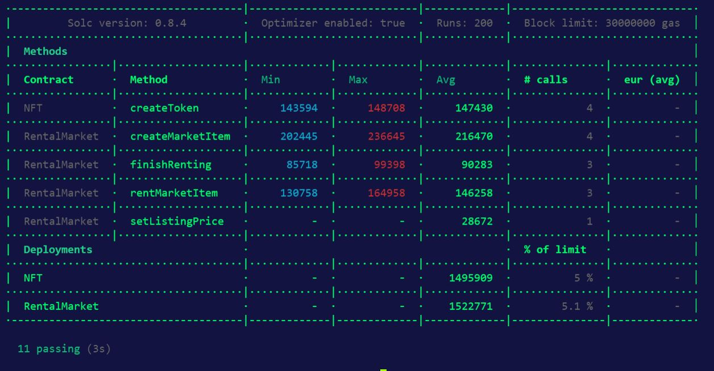
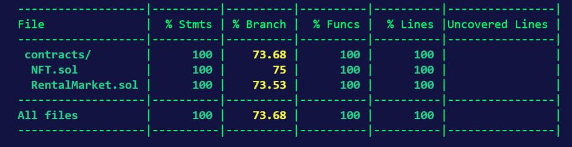

# 💎NFT Rental Marketplace 💸Collateral Free Renting🆓

## [💎Check Out](https://nft-rental-marketplace.netlify.app) 🔔 [nft-rental-marketplace.netlify.app](https://nft-rental-marketplace.netlify.app/) 

## Project Description 📝

### 💎Fullstack NFT Rental Marketplace Dapp ✨Collateral Free Renting✨

- NFT Owners can rent their NFT by specifying the name, description, rental duration, and rental price. 
- Anyone can rent the NFT from the Rental Marketplace by paying the rental price.
- The Renter will not be able to transfer the rented NFT to anyone. 
- After the end of the rental duration, either the renter, owner or anyone can call finishRenting function to transfer the NFT from Renter to the NFT Owner.


<details> 
  <summary> Working Explained In Detail </summary>
  <h2> Working Explained In Detail </h2>

- Anyone who has created a ERC721 contract with additional functions similar to NFT.sol can list their NFTs for Rent in the Marketplace.
- When an owner lists a NFT for rent in the Marketplace, the ownership of the item will be transferred from the owner to the marketplace.
- Anyone can rent the NFTs listed in the marketplace by paying rent.
- When a user rents a NFT, the rental price will be transferred from the buyer to the seller and the NFT will be transferred from the marketplace to the renter.
- The Renter will not be able to transfer the NFT to anyone, because the NFT.sol contract prevents the token transfer while it is on rent.
- Finish Renting function will enable anyone to end the renting process, and return the NFT to the NFT Owner. 


<strong> The marketplace owner will be able to set a listing fee. This fee will be paid by the NFT owner when listing NFT in the renal marketplace, and transferred to the contract owner, enabling the owner of the marketplace to earn recurring revenue from any listing transacted in the marketplace. </strong>

 
</details>

  

## About Contracts 📄

#### This Project Is Deployed On [Polygon Mumbai Testnet [Check Out The Contract At]](https://mumbai.polygonscan.com/address/0x545f40130d0e93bc53f5f496079e4e6a4a0327d7) 

This project consists of two smart contracts:

- NFT Contract - This contract allows users to mint unique digital assets.

- Marketplace Contract - This contract allows NFT owners to put their digital assets for rent on an open market.

## About Frontend 🎨🖌 - [Frontend Code Is Here](https://github.com/ShivaShanmuganathan/rental-marketplace-frontend)

#### This project consists of five pages

- Home - Displays all NFTs listed for rent in the rental marketplace
- Create NFTs - Users can create their own NFTs by filling all the details in this page
- My NFTs - Users can view the NFTs they have created
- Rented NFTs - Users can view the NFTs they have rented
- Claimable NFTs - Users can view all NFTs that is past the rental duration

## Directory Structure 📂
- `contracts` ⏩ NFT Rental Marketplace and NFT Smart contracts that are deployed in the Polygon Mumbai Test Network.
- `test` ⏩ Tests for Smart Contracts.

## How To Run This Project Locally 🏃🏾‍♂️💨

### Clone This Repo
```shell

git clone https://github.com/ShivaShanmuganathan/NFT-Rental-Marketplace.git
cd NFT-Rental-Marketplace

```

### Install Dependencies

``` shell
npm install
```
Rename `.secret-example` to `.secret` ⏩ Then paste your private-key in the .secret file

### Compile The Contracts & Test It

``` shell

npx hardhat compile
npx hardhat test

```

### [Frontend Instructions](https://github.com/ShivaShanmuganathan/rental-marketplace-frontend)

``` shell
git clone https://github.com/ShivaShanmuganathan/rental-marketplace-frontend
cd rental-marketplace-frontend
npm install
npm run dev
```


## Working Explained In Detail 📃
- Anyone who has created a ERC721 contract with additional functions similar to NFT.sol can list their NFTs for Rent in the Marketplace.
- When an owner lists a NFT for rent in the Marketplace, the ownership of the item will be transferred from the owner to the marketplace.
- Anyone can rent the NFTs listed in the marketplace by paying rent.
- When a user rents a NFT, the rental price will be transferred from the buyer to the seller and the NFT will be transferred from the marketplace to the renter.
- The Renter will not be able to transfer the NFT to anyone, because the NFT.sol contract prevents the token transfer while it is on rent.
- Finish Renting function will enable anyone to end the renting process, and return the NFT to the NFT Owner. 

``` The marketplace owner will be able to set a listing fee. This fee will be paid by the NFT owner when listing NFT in the renal marketplace, and transferred to the contract owner, enabling the owner of the marketplace to earn recurring revenue from any listing transacted in the marketplace. ```


## Gas Report ⛽


## Test Coverage Report 🛸


## Demo GIF 🎥

